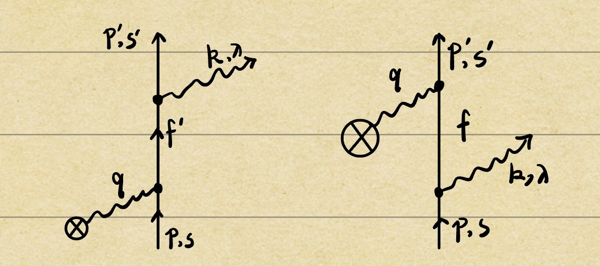

<!-- 使图像可以居中 -->

<!-- _footer: ref [[1]]: KARLOVETS D V, SERBO V G, 2020. Effects of the transverse coherence length in relativistic collisions[J/OL]. Physical Review D, 101(7): 076009.-->

# LG态涡旋电子的轫致辐射

 

**为什么要用 Laguerre-Gaussian 态？**
 

在单涡旋散射的情况下,对于贝塞尔态，其散射截面对OAM一般不敏感；而 LG 态则相反，因为其平均横动量随 $\sqrt{l}$ 的增大而增大[[1]]

[1]:ref/Karlovets%20和%20Serbo%20-%202020%20-%20Effects%20of%20the%20transverse%20coherence%20length%20in%20rela.pdf

---
## 标量粒子的 LG 波函数[[2]]
<!-- _footer: ref [[2]]: KARLOVETS D, 2018. Relativistic vortex electrons: Paraxial versus nonparaxial regimes[J/OL]. Physical Review A, 98(1): 012137. -->

$$\phi_l(\boldsymbol{k})=(4\pi)^{3/4}\sigma_\perp\sqrt{\sigma_z}\sqrt{2\epsilon(\bold{k})} \ \frac{(\sigma_\perp k_\perp)^{|l|}}{\sqrt{|l|!}}\  \text{exp}[{-k_\perp^2\sigma_\perp^2/2-(k_z-p_z)^2\sigma_z^2/2+il\varphi}]$$
> $\int \dfrac{d^3 k}{(2\pi)^3 2\epsilon(\bold{k})} |\phi_l(\boldsymbol{k})|^2=1$

广义拉盖尔多项式有：
  $$\int_0^ \infty  \dfrac{n!}{\Gamma(n+|l|+1)} \ x^{|l|} \ e^{-x}|L_n^{|l|}(x)|^2\ dx=1$$
若 $n=0$ ，则 $\Gamma(|l|+1)=|l|!$ 且 $L_{0}^{|l|}(x)=1$ ，再使 $x\rightarrow \sigma_\perp^2k^2_\perp$ ，即可得：
$$\int_0^ \infty  \frac{1}{|l|!} \ (\sigma_\perp^2k^2_\perp)^{|l|} \ e^{-\sigma_\perp^2k^2_\perp}\ d(\sigma_\perp^2k^2_\perp)=1$$
<!-- 横向是n=0的拉盖尔态 -->
<!-- 而z方向则是一个高斯波包 -->
[2]:ref/Karlovets%20-%202018%20-%20Relativistic%20vortex%20electrons%20Paraxial%20versus%20non.pdf

---
## 非涡旋S矩阵
**费曼图**

---
<!-- $S=\bold{1}+iT \rightarrow \left<f|S|i\right>=\left<f|\bold{1}|i\right>+\left<f|iT|i\right>=\left<f|iT|i\right>$ -->
$$
\begin{align*}
  \left<f|S|i\right>&=e^2\int d^4xd^4y\  \bar{\psi}(x) [(-i \gamma^\upsilon A_\upsilon(y,k))iS_F(x-y)(-i\gamma^0)A_0^{coul}(y)\\
  &\qquad \qquad  +(-i\gamma^0)A_0^{coul}(x)iS_F(x-y)(-i \gamma^\mu A_\mu(y,k))]\psi_i(y)\\ \\
  &= -Ze^3 \int d^4xd^4y\ \frac{d^3q}{(2\pi)^3} \ \bar{u}(p',s')e^{ip'x}\ [-i\gamma^\upsilon\epsilon_\upsilon^* e^{ikx} \int \frac{d^4f'}{(2\pi)^4} \frac{ie^{-if'(x-y)}}{\not{f'}-m_e}(-i\gamma^0)\frac{e^{i\boldsymbol{q \cdot y}}}{\boldsymbol{q}^2}\\
  & \qquad \qquad -i\gamma^0\frac{e^{i\boldsymbol{q \cdot x}}}{\boldsymbol{q}^2}\int \frac{d^4 f}{(2\pi)^4}\frac{ie^{-if(x-y)}}{\not{f}-m_e}(-i\gamma^\mu\epsilon^*_\mu) e^{iky} ]\ u(p,s)e^{-ipy}
\end{align*}
$$

> 取 $\alpha=\frac{e^2}{\sqrt{4\pi}}=\frac{1}{137}$ ，这里用到了 $A_0^{coul}(x)=-\frac{Ze}{4\pi |\boldsymbol{x}|}=-Ze\int \frac{d^3q}{(2\pi)^3} \ \frac{1}{\boldsymbol{q}^2} e^{i\boldsymbol{q\cdot x}}$

 

积分后可得 $\left<f|S|i \right>=2\pi i \delta(\epsilon'+\omega-\epsilon)M_{fi}$
$$M_{fi}=-Ze^3\ \frac{1}{\boldsymbol{q}^2}\ \bar{u}(p',s')\left[\not{\epsilon^*(k,\lambda)}\frac{\not{p'}+\not{k}+m_e}{(p'+k)^2-m^2_e}\gamma_0+\gamma_0\frac{\not{p}-\not{k}+m_e}{(p-k)^2-m^2_e}\not{\epsilon^*(k,\lambda)}\right]u(p,s)$$

---
## 单涡旋S矩阵
令初态电子为涡旋态：
$$\left|i\right>=\int \frac{d^3p}{(2\pi)^3\sqrt{2\epsilon}} \ \phi_l(\boldsymbol{p})\ \left|\boldsymbol{p}\right>$$
> 这里选取洛伦兹不变的归一化：$\left<\boldsymbol{p|p'}\right>=2\epsilon(\boldsymbol{p})\delta^{(3)}(\boldsymbol{p-p'})\delta_{ss'}$

则S矩阵为：
$$
\begin{align*}
  \left<f|S|i \right>&=\int \frac{d^3p}{(2\pi)^3\sqrt{2\epsilon}} \ \phi_l(\boldsymbol{p})\ \left<p'k|S|pq \right>\\
  &=\int  \frac{d^3p}{(2\pi)^3\sqrt{2\epsilon}} \ \phi_l(\boldsymbol{p})\ 2\pi i\delta(\epsilon'+\omega-\epsilon) \ M_{pw}
\end{align*}
$$

---
则跃迁概率为：